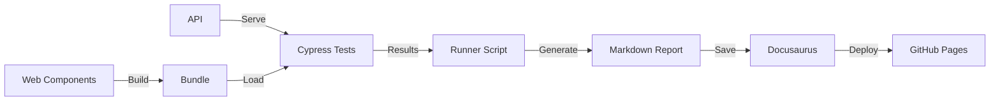

# 🎯 Bem-vindo ao Portal de QA

Este portal documenta o projeto **Example Cypress Report Regression** - um sistema completo de testes automatizados com documentação gerada automaticamente.

## 🏗️ Arquitetura do Projeto

O projeto é um **monorepo** com 4 aplicações integradas:

### 📦 Aplicações

1. **`web-components/`** - Microfrontends Angular
   - Web Components reutilizáveis
   - Build otimizado
   - Componentes isolados

2. **`api/`** - API Node.js
   - Express + TypeScript
   - Endpoints fake para testes
   - CORS habilitado

3. **`cypress/`** - Automação de Testes
   - Testes E2E
   - Comandos customizados
   - Integração com MFEs

4. **`docs/`** - Portal Docusaurus
   - Documentação viva
   - Relatórios automáticos
   - Histórico de testes

## 🔄 Pipeline de QA



## 🚀 Início Rápido

### Instalação

```bash
# Clone o repositório
git clone <repo-url>
cd example-cypress-report-regression

# Instale todas as dependências
npm run install:all
```

### Executar Testes

```bash
# 1. Build dos web components
cd web-components && npm run build && cd ..

# 2. Inicie a API
npm run api:dev &

# 3. Execute o runner
node cypress/scripts/runner.js
```

### Visualizar Relatórios

```bash
npm run docs:start
# Acesse http://localhost:3000/historico
```

## 📚 Documentação

- [Guia do Pipeline de QA](./qa-pipeline-guide.md) - Como usar o sistema
- [Histórico de Testes](./historico) - Relatórios automáticos
- [Comandos Cypress](./qa-pipeline-guide.md#-comandos-customizados-do-cypress) - cy.visitMfe(), cy.loginAzure()

## 🎯 Recursos Principais

### ✅ Testes Automatizados
- Testes E2E com Cypress
- Mock de Azure AD
- Shell para Microfrontends
- Validação de bundle size

### 📊 Relatórios Automáticos
- Geração de Markdown
- Frontmatter para Docusaurus
- Admonitions (tip, warning, danger)
- Metadados do Git

### 🚀 CI/CD
- GitHub Actions
- Build automático
- Deploy no GitHub Pages
- Histórico persistente

## 🔧 Tecnologias

| Categoria | Tecnologias |
|-----------|-------------|
| **Frontend** | Angular 21, Web Components, SCSS |
| **Backend** | Node.js, Express, TypeScript |
| **Testes** | Cypress 13, TypeScript |
| **Docs** | Docusaurus 3, React, MDX |
| **CI/CD** | GitHub Actions, GitHub Pages |

## 📖 Próximos Passos

1. 📘 Leia o [Guia do Pipeline](./qa-pipeline-guide.md)
2. 🧪 Execute os testes localmente
3. 📊 Explore o [Histórico de Testes](./historico)
4. 🚀 Configure o GitHub Actions

## 🤝 Contribuindo

Este é um projeto de exemplo para demonstrar integração de QA com documentação automática. Sinta-se livre para adaptar para suas necessidades!

---

**Última atualização:** 2025-12-01
